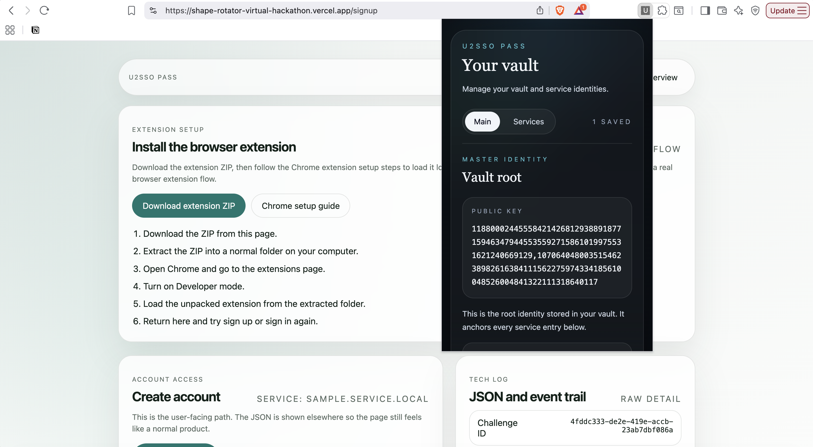

# U2SSO Pass

## Live App

https://shape-rotator-virtual-hackathon.vercel.app

## Demo

https://youtu.be/ckCiXJDmCkU

## Description

U2SSO Pass is a Chrome-extension-based identity demo inspired by the paper **Anonymous Self-Credentials & SSO** and implemented with the sample U2SSO flow.

It is designed to make the protocol easier to try and understand in a practical product-like experience.

## What’s Included

- **Contract registry** for master identity registration
- **Chrome extension** for generating identity-related payloads
- **Authentication pages** for sign up and sign in

## How It Works

1. A user creates a **master identity**
2. The master identity is **registered on-chain**
3. For each service, a **child credential** is created
4. A **zero-knowledge proof** connects the child credential to the master identity
5. This allows the user to authenticate **anonymously**
6. A **nullifier** is derived from the service and the master identity
7. The nullifier provides **service-specific Sybil protection** by preventing repeated use of the same identity for the same service

## Why It Matters

U2SSO Pass shows how anonymous self-credentials can be turned into a usable flow for real users:

- the user keeps privacy
- each service gets a separate credential
- the protocol still prevents duplicate abuse
- the experience stays close to normal sign up and sign in
